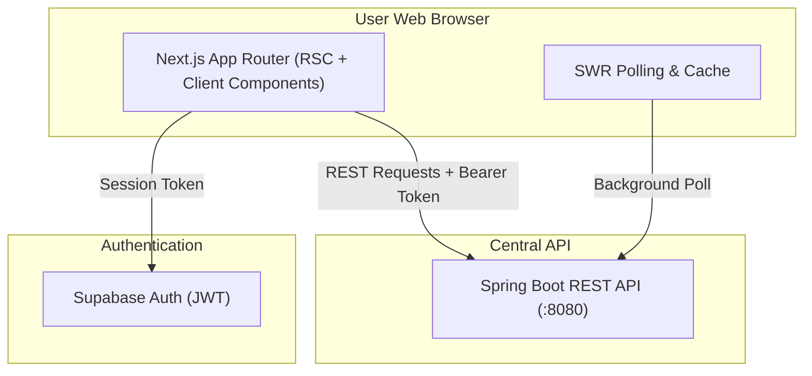

# Ceylon News

A full-stack multilingual news intelligence platform for Sri Lankan news that collects reports from multiple publishers, processes and enriches them, groups related publisher reports into real-world Story clusters, supports English/Sinhala/Tamil experiences, and provides search, reporting-activity trending, coverage comparison, timelines, grounded Story Q&A, personalization, notifications, privacy-conscious analytics, and operational administration.

The system is composed of three independently maintained services:

- **Next.js Frontend** — reader, account, personalization, and admin experiences
- **Spring Boot Backend** — APIs, persistence, processing, Story intelligence, search, AI orchestration, authentication, notifications, and analytics
- **Python Ingestion Service** — publisher discovery, extraction, and scheduled ingestion

---

## Frontend Repository

This repository contains the presentation and application layer built with **Next.js 16 (App Router)**, **React 19**, **TypeScript**, and **Tailwind CSS v4**. It communicates strictly with the Spring Boot backend REST APIs and utilizes Supabase for client-side authentication session management.

---

## Table of Contents

- [What the Frontend Provides](#what-the-frontend-provides)
- [UI Architecture](#ui-architecture)
- [Technology Stack](#technology-stack)
- [Frontend Architecture Diagram](#frontend-architecture-diagram)
- [Authentication](#authentication)
- [API Communication](#api-communication)
- [Search & Discovery](#search--discovery)
- [Story Intelligence UI](#story-intelligence-ui)
- [Personalization](#personalization)
- [Analytics & Privacy](#analytics--privacy)
- [Accessibility & Responsive Design](#accessibility--responsive-design)
- [Multilingual UI](#multilingual-ui)
- [Project Structure](#project-structure)
- [Getting Started](#getting-started)
- [Environment Variables](#environment-variables)
- [Available Scripts](#available-scripts)
- [Testing & Verification](#testing--verification)
- [Security Notes](#security-notes)
- [Related Repositories](#related-repositories)

---

## What the Frontend Provides

The frontend application provides 28 authoritative routes structured across 6 core functional areas:

### Public Discovery (7 Routes)
- `/` — Flagship home discovery feed featuring top grouped stories, trending topics, and latest publisher reports
- `/stories` — Full index of grouped multi-publisher Story clusters
- `/trending` — Reporting-activity trending stories ranked by publisher reporting intensity
- `/search` — Dual-mode search interface supporting Keyword (lexical) and Semantic (meaning-based) query modes
- `/article/[id]` — Article detail view with source attribution and direct outbound link to original publisher
- `/story/[id]` — Flagship Story Intelligence workspace featuring summary, multi-publisher coverage, timeline, and grounded Q&A
- `/source/[slug]` — Publisher profile view displaying publisher metadata, reliability status, and recent reports

### My News / Personalization (4 Routes)
- `/for-you` — Privacy-safe personalized feed based on user's followed sources and topics
- `/bookmarks` — Saved articles library for offline reading and reference
- `/following` — Management hub for followed news sources and topic tags
- `/notifications` — User notification center displaying system and story updates

### Account Management (3 Routes)
- `/account` — User profile settings, display language, and category preferences
- `/account/notifications` — Notification delivery preferences, quiet hours, and timezone settings
- `/account/privacy` — Analytics opt-in/opt-out preferences and data privacy controls

### Authentication (4 Routes)
- `/auth/login` — Email/password authentication sign-in screen
- `/auth/sign-up` — Account registration interface
- `/auth/forgot-password` — Password reset request form
- `/auth/reset-password` — Password update token verification form
- `/auth/logout` — Safe session sign-out route handler (supporting GET and POST navigation)

### Utility (1 Route)
- `/notifications/unsubscribe` — One-click email notification unsubscription page with signed token confirmation

### Admin Operations Shell (9 Routes)
- `/admin` — Operational overview dashboard with system metrics
- `/admin/ingestion` — Ingestion health monitoring, scheduler controls, and source run history
- `/admin/processing` — Async background processing queues and dead-letter queue (DLQ) operations
- `/admin/sources` — Publisher source registry management and health tracking
- `/admin/stories` — Story cluster inspection, manual merge/split management, and status overrides
- `/admin/ai` — Gemini AI provider status, model latency, and token consumption tracking
- `/admin/analytics` — Aggregate, privacy-preserving reader engagement metrics
- `/admin/users` — Aggregate user preference statistics and subscription metrics
- `/admin/audit` — Append-only security audit log tracking administrative operations

---

## UI Architecture

The frontend follows a modern Next.js 16 App Router pattern:

- **Server Components (RSC)**: Used for data fetching, SEO rendering, and initial layout generation to minimize client JavaScript payload size.
- **Client Components (`"use client"`)**: Employed for interactive controls, stateful forms, SWR data polling, and dynamic UI transitions.
- **R1 Design Tokens & Surface Primitives**: Styled with Vanilla Tailwind CSS v4 using a cohesive dark/light surface hierarchy, dynamic focus states, and glassmorphism accents.
- **Card Separation**: Strict visual distinction between single-report `ArticleCard` and clustered `StoryCard` components.
- **Responsive Layout Shells**: Mobile drawer navigation active at `<1024px`; horizontal desktop navigation header active at `>=1024px`.

---

## Technology Stack

- **Framework**: Next.js 16.3.3 (App Router with Turbopack)
- **Library**: React 19.2.8
- **Language**: TypeScript 5
- **Styling**: Tailwind CSS v4 (`@tailwindcss/postcss`)
- **Icons**: Lucide React (`lucide-react` v1.40.0)
- **Data Fetching**: SWR (`swr` v2.5.1)
- **Authentication**: Supabase SSR (`@supabase/ssr` v0.12.5, `@supabase/supabase-js` v2.112.4)
- **Test Runner**: Node Test Runner via TSX (`tsx` v4.20.6)

---

## Frontend Architecture Diagram



---

## Authentication

User authentication is managed via Supabase Auth:
1. Users authenticate through `/auth/login` or `/auth/sign-up`.
2. Supabase issues a JWT session token stored in secure HTTP-only cookies via `@supabase/ssr`.
3. The frontend passes this JWT as a `Bearer` token in the `Authorization` header to the Spring Boot backend.
4. The Spring Boot backend independently validates the JWT via Supabase JWKS without trusting raw user IDs from client payloads.

---

## API Communication

- The frontend communicates **exclusively** with the Spring Boot backend REST API.
- The frontend **never** connects directly to MongoDB Atlas, Redis, or internal ingestion endpoints.
- API requests use a centralized HTTP client (`src/lib/api/client.ts`) that standardizes error handling (`ApiError`), query string serialization, and header injection.

---

## Search & Discovery

- **Keyword Mode**: Performs fast lexical search matching query terms across titles, snippets, and keywords.
- **Semantic Mode**: Leverages backend vector search (Atlas Vector Search + Gemini embeddings) to retrieve stories and articles based on conceptual meaning.
- **Trending**: Ranks stories strictly by publisher reporting activity and reporting volume within a recency decay window.

---

## Story Intelligence UI

The Story detail view (`/story/[id]`) presents comprehensive event intelligence:
- **Story Summary**: AI-generated neutral executive summary.
- **Publisher Reports**: Multi-publisher coverage broken down by publisher provenance and original language.
- **Coverage Comparison**: Grid view comparing publisher perspectives, framing, and reporting focus.
- **Timeline**: Chronological event progression tracking key developments.
- **Ask This Story**: Grounded Q&A interface allowing readers to ask questions specific to the Story's underlying articles.

---

## Personalization

- **For You**: Recommends relevant stories using the reader's explicitly followed sources and topic tags.
- **Bookmarks**: Allows users to save articles for quick reference.
- **Following**: Manages source and topic subscriptions.
- **Notifications**: Delivers in-app alerts for breaking developments in followed topics.

---

## Analytics & Privacy

- Collects minimal, privacy-conscious reader engagement telemetry (e.g., page views, story interactions).
- **Zero Raw PII**: Never transmits raw search queries, user email addresses, notification contents, or Ask Q&A text.
- Respects browser `Do Not Track` (DNT) and `Global Privacy Control` (GPC) signals by completely disabling analytics tracking when active.

---

## Accessibility & Responsive Design

- Tested and verified across 8 standard breakpoints: `320px`, `375px`, `390px`, `768px`, `820px`, `1024px`, `1280px`, and `1440px`.
- Mobile/Tablet Drawer Shell: Active at `<1024px`.
- Desktop Shell Navigation: Active at `>=1024px` (`lg` breakpoint).
- High-contrast visual hierarchy, explicit focus rings, semantic HTML structure, and keyboard-accessible modal overlays.

---

## Multilingual UI

- First-class support for **English (EN)**, **Sinhala (SI)**, and **Tamil (TA)**.
- Features dynamic display language switching (`?lang=en|si|ta`) while preserving active search queries, filters, and pagination state.
- Clearly demarcates original publisher language versus translated summary content to preserve source attribution integrity.

---

## Project Structure

```
sri-lanka-news-frontend/
├── public/                     # Static assets, favicon, brand icons
├── src/
│   ├── app/                    # Next.js App Router (28 routes)
│   │   ├── (discovery)/        # Public reader routes (/, stories, trending, search, etc.)
│   │   ├── account/            # User profile & preference settings
│   │   ├── admin/              # Admin operational management shell
│   │   ├── auth/               # Auth routes & sign-out API handler
│   │   └── notifications/      # Unsubscribe utility
│   ├── components/             # Reusable UI components & design system primitives
│   ├── lib/                    # API clients, SWR hooks, types, & utility functions
│   └── middleware.ts           # Route protection & session refresh middleware
├── eslint.config.mjs           # ESLint configuration
├── next.config.ts              # Next.js build configuration
├── postcss.config.mjs          # PostCSS configuration for Tailwind v4
└── tsconfig.json               # TypeScript configuration
```

---

## Getting Started

### Prerequisites
- Node.js `20.x` or higher
- npm `10.x` or higher
- Running Spring Boot backend (`http://localhost:8080`)

### Installation
```bash
# Clone repository
git clone https://github.com/dulanprabashwara/sri-lanka-news-frontend.git
cd sri-lanka-news-frontend

# Install dependencies
npm install
```

### Development Server
```bash
# Copy example environment configuration
cp .env.example .env.local

# Run Next.js development server
npm run dev
```
Open [http://localhost:3000](http://localhost:3000) with your browser.

---

## Environment Variables

Configure `.env.local` using variable names from `.env.example`:

| Variable Name | Purpose | Scope |
|---|---|---|
| `API_BASE_URL` | Base URL of Spring Boot backend (e.g., `http://localhost:8080`) | Server-Only |
| `NEXT_PUBLIC_SUPABASE_URL` | Public Supabase project URL | Public / Client |
| `NEXT_PUBLIC_SUPABASE_PUBLISHABLE_KEY` | Public Supabase API key | Public / Client |

> **Note**: Never commit secret keys or real Supabase tokens to source control.

---

## Available Scripts

- `npm run dev` — Starts local development server with Turbopack.
- `npm run build` — Creates optimized production build.
- `npm run start` — Runs compiled production build.
- `npm run lint` — Runs ESLint code quality checks.
- `npm run typecheck` — Runs TypeScript type compiler without emitting files.
- `npm run test` — Executes test suite using Node.js Test Runner and TSX.

---

## Testing & Verification

The frontend repository includes automated behavioral and component tests.

```bash
# Run full test suite
npm run test

# Run type check
npm run typecheck

# Run linting
npm run lint

# Validate production build
npm run build
```

**Verified R8 Baseline**:
- 111 tests PASS
- 0 TypeScript errors
- 0 ESLint errors / 0 warnings
- Production build PASS

---

## Security Notes

- JWT authentication tokens are strictly handled using secure Supabase cookies.
- Admin endpoints are protected by role checks verified against backend authority.
- All outbound publisher links use `rel="noopener noreferrer"` and enforce secure HTTP/HTTPS protocols.

---

## Related Repositories

| Repository | Description |
|---|---|
| [sri-lanka-news-backend](https://github.com/dulanprabashwara/sri-lanka-news-backend) | Spring Boot 3.5 REST API, persistence, AI orchestration & security |
| [sri-lanka-news-ingestion](https://github.com/dulanprabashwara/sri-lanka-news-ingestion) | Python 3.12 scheduled publisher extraction & ingestion service |
